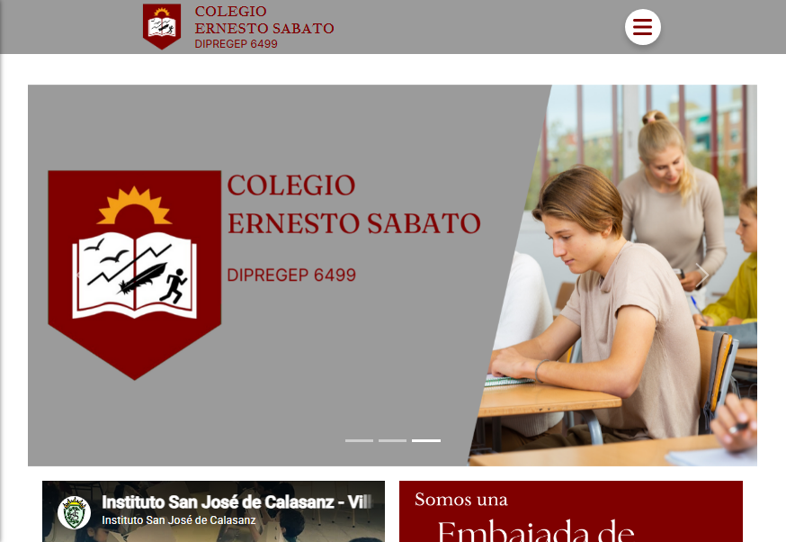
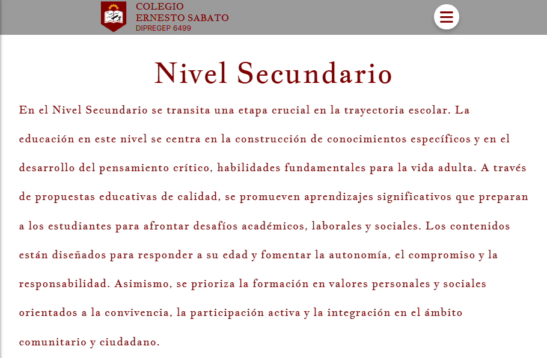
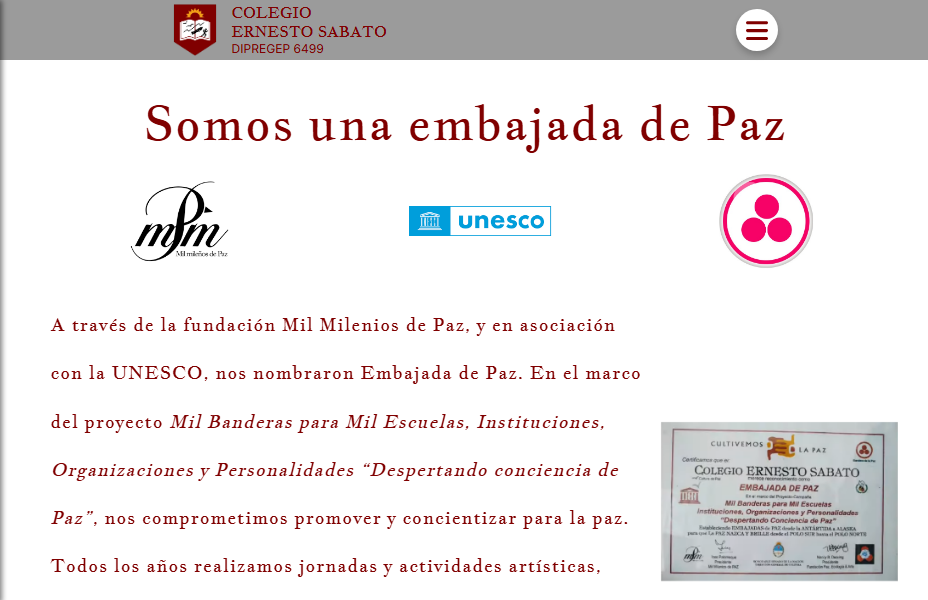
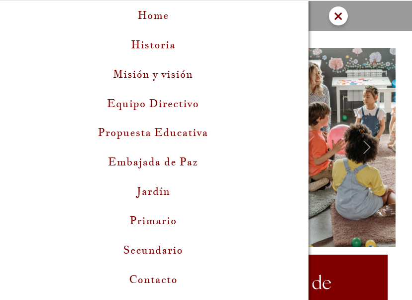
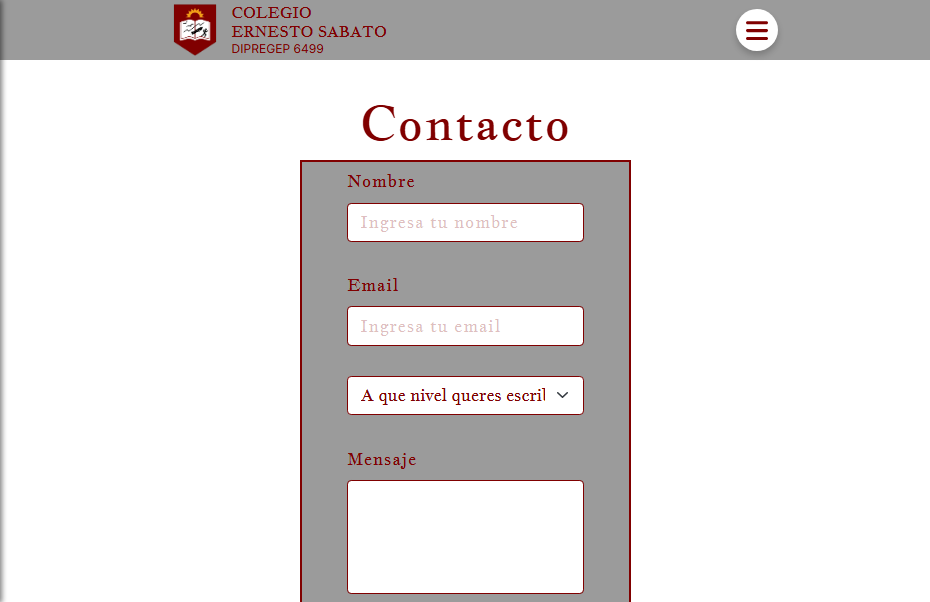

# Colegio Ernesto Sabato

A responsive institutional website developed for Colegio Ernesto Sabato. The project was created for a real client with the goal of providing information about the institution, its educational levels, contact channels, and educational proposal.

> **Note:** This project is currently considered a first version (MVP). Some sections contain placeholder content because the client did not provide the final information. A complete redesign using React and Tailwind CSS is planned.

## 🌐 Live Demo

https://colegioernestosabatohurlingham.netlify.app/

---

## 📸 Preview

### Home


### Educational Levels


### Peace Embassy


### Mobile Navigation


### Contact Form


---

## ✨ Features

- Responsive design for desktop and mobile devices
- Institutional information pages
- Educational levels section
- Image carousel
- Contact form
- Email integration using EmailJS
- Responsive navigation menu
- Social media integration
- Bootstrap-based UI components

---

## 🛠 Technologies

- React
- React Router
- Bootstrap
- React Bootstrap
- Reactstrap
- EmailJS
- Font Awesome
- CSS3

---

## 🚀 Installation

```bash
git clone https://github.com/stkener/paginaSabato.git

cd paginaSabato

npm install

npm start
```

---

## 📌 Project Status

Completed first version.

A future update is planned with:

- React 19
- Tailwind CSS
- Modern UI/UX redesign
- Improved component architecture
- Content completion

---

## 👨‍💻 Author

**Sebastián Kener**

Technical University Programmer | Junior/Trainee Software Developer

- 🌐 **Portfolio:** https://stkener.github.io/portfolio_sebastian/
- 💼 **LinkedIn:** https://linkedin.com/in/sebastiankener
- 💻 **GitHub:** https://github.com/stkener

---

## 📄 License

This project was developed for a real client and is published exclusively as part of my professional portfolio.
